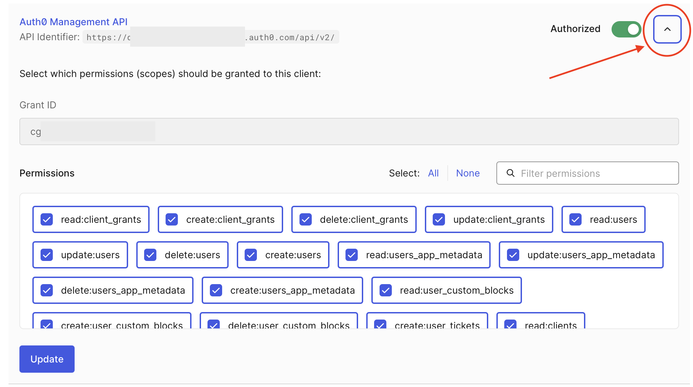

## Example: Auth0

This guide uses [Auth0](https://auth0.com/) as the Identity Provider.

### Pre-requisites

1. [Create an Apollo account](https://studio.apollographql.com/signup?referrer=docs-content).

1. Clone the repo for the example project.

   ```sh showLineNumbers=false
   git clone git@github.com:apollographql/apollo-mcp-server.git
   ```

1. Install or update the Rover CLI. You need at least v0.35 or later.

   ```sh showLineNumbers=false
   curl -sSL https://rover.apollo.dev/nix/latest | sh
   ```

### Step 1: Set up the Auth0 Identity Provider

[Create an Auth0 account](https://auth0.com/).

#### Create the Auth0 API

1. In your dashboard, navigate to **Applications** -> **APIs**.
1. Click **Create API**.
1. Give it a friendly name like `MCP Auth API`.
1. For the **Identifier** field, Auth0 recommends using a URL. This identifier is used in the MCP server configuration later as the `audience` property. For this guide, use `http://localhost:5000/mcp-example`.
1. Leave the defaults for the rest of the fields and click **Create**.
1. Navigate to your dashboard **Settings**.
   1. Under **General** -> **API Authorization Settings**, set the **Default Audience** to the `Identifier` you chose.
   1. Navigate to the **Advanced** tab.
   1. Toggle on **OIDC Dynamic Application Registration** to enable [dynamic client registration](https://auth0.com/docs/get-started/applications/dynamic-client-registration#enable-dynamic-client-registration).
   1. Toggle on **Enable Application Connections**.
   1. Save your changes.

#### Create the Auth0 Connection

The Auth0 Connection is the method clients use to authenticate. This guide uses the default **Username-Password-Authentication** connection.

1. In your Auth0 dashboard, navigate to **Authentication** -> **Database**.
1. Create the default **Username-Password-Authentication** connection. Click the **Try Connection** button to test it and set up a username and password for later.
1. Back on your Auth0 dashboard, note the **Connection Identifier** at the top of the page. It should start with something like `con_`. Copy it into a temporary location. This guide refers to it as `<CONNECTION ID>`.
1. Navigate to **Applications** -> **APIs** -> **Auth0 Management API**.
1. Copy the **Identifier** for the Auth0 Management API to a temporary location. It should look something like `dev-123456.us.auth0.com`, where `dev-123456` is your Auth0 tenant ID. This guide refers to it as `<AUTH0 DOMAIN>`.
1. Click the **API Explorer** tab. Copy the token value to a temporary location. This guide refers to it as `<MGMT API ACCESS TOKEN>`.
1. Run the following `curl` command to promote the connection to domain level, replacing `<CONNECTION ID>`, `<AUTH0 DOMAIN>`, and `<MGMT API ACCESS TOKEN>` with the values you copied in the previous steps:

   ```sh
   curl --request PATCH \
     --url 'https://<AUTH0 DOMAIN>/api/v2/connections/<CONNECTION ID>' \
     --header 'authorization: Bearer <MGMT API ACCESS TOKEN>' \
     --header 'cache-control: no-cache' \
     --header 'content-type: application/json' \
     --data '{ "is_domain_connection": true }'
   ```

Your Auth0 setup is now complete. You have an API with an audience and a connection for authentication.

<ExpansionPanel title="Something went wrong? Try these troubleshooting steps">
  - Check that the `curl` command is correct and that you have the correct values for `<CONNECTION ID>`, `<AUTH0 DOMAIN>`, and `<MGMT API ACCESS TOKEN>`.
  - Check that you have the correct permissions to promote the connection to domain level. 
    - In your Auth0 dashboard, navigate to **Applications** -> **API Explorer Application** -> **APIs**. Ensure that the **Auth0 Management API** is authorized.
    - Expand the **Auth0 Management API** item and enable the `update:connections` permission.
    
    - Click **Update** to save your changes.
</ExpansionPanel>

### Step 2: Configure the MCP Server for authorization

Configure the MCP server to use the Auth0 instance for authentication.

1. Open the example repo you cloned earlier.
1. In the `graphql/TheSpaceDevs` directory, open the `config.yaml` file.
1. Add the following `auth` configuration under the `transport` key:

   ```yaml title="graphql/TheSpaceDevs/config.yaml"
   transport:
     type: streamable_http

     auth:
       servers:
         - https://<AUTH0 DOMAIN> # Fill in your Auth0 domain
       audiences:
         - <AUTH0 DEFAULT AUDIENCE> # Fill in your Auth0 Identifier
       resource: http://127.0.0.1:5000/mcp
       scopes:
         - read:users # Adjust scopes as needed
   ```

1. Replace the `<AUTH0 DOMAIN>` with your own Auth0 domain from earlier.

1. Replace the `<AUTH0 DEFAULT AUDIENCE>` with the matching `Identifier` you set when creating the Auth0 API. In this guide, you used `http://localhost:5000/mcp-example`.

Your MCP server is now configured to use Auth0 for authentication.

### Step 3: Configure the router for JWT authentication

Configure your GraphOS Router to validate JWTs issued by Auth0. This involves setting up the JWKS endpoint and defining the authorization rules.

#### Define authorization and authentication rules in the router

1. In the `graphql/TheSpaceDevs` directory, create a new file called `router.yaml`.
1. Paste the following configuration, replacing `<AUTH0 DOMAIN>` with your Auth0 domain:

   ```yaml title="graphql/TheSpaceDevs/router.yaml"
   authorization:
     require_authentication: true # Enforces authentication on all requests
   authentication:
     router:
       jwt:
         jwks:
           - url: https://<AUTH0 DOMAIN>/.well-known/jwks.json
   homepage:
     enabled: false
   sandbox:
     enabled: true
   supergraph:
     introspection: true
   ```

   With this configuration, the router requires authentication for all requests. If a request doesn't include an Authorization token, the router returns an `UNAUTHENTICATED` error.

#### Retrieve your GraphOS license credentials for auth

You need a graph's credentials and a valid GraphOS plan to use the router's authentication features.

1. Navigate to [GraphOS Studio](https://studio.apollographql.com/) and log in.
1. Click **Add graph** and **Connect an existing graph**.
1. Give it a name and click **Next**.
1. In the next modal, find the command that looks something like this:

   ```sh showLineNumbers=false {2}
   APOLLO_KEY=<YOUR_APOLLO_KEY> \
   rover subgraph publish <YOUR_APOLLO_GRAPH_REF> \
   --schema ./products-schema.graphql \
   --name your-subgraph-name \
   --routing-url http://products.prod.svc.cluster.local:4001/graphql
   ```

   Note: You don't need to run this command.

1. Retrieve the values for `YOUR_APOLLO_KEY` and `YOUR_APOLLO_GRAPH_REF` from the modal and click **Finish later**.

#### Run the MCP Server and router

1. Back in your terminal, in the root of the project directory, replace and run the following command to start the MCP Server and the router together:

   ```sh
   APOLLO_GRAPH_REF=<YOUR_APOLLO_GRAPH_REF> APOLLO_KEY=<YOUR_APOLLO_KEY> \
   rover dev --supergraph-config ./graphql/TheSpaceDevs/supergraph.yaml \
   --router-config ./graphql/TheSpaceDevs/router.yaml \
   --mcp ./graphql/TheSpaceDevs/config.yaml
   ```

1. Test the router by navigating to `http://localhost:4000` in your browser. You should see the Explorer, where you can run GraphQL queries against the router.

1. Remember, the router is configured to require authentication on all requests. Any operations without a valid Authorization token returns an `UNAUTHENTICATED` error. Run the operation:

   ```graphql
   query GetAstronautsCurrentlyInSpace {
     astronauts(filters: { inSpace: true, search: "" }) {
       results {
         id
         name
         timeInSpace
         lastFlight
       }
     }
   }
   ```

1. You should see an `UNAUTHENTICATED` error, which means the router is correctly enforcing authentication.

### Step 4: Make requests with MCP Inspector

1. In a new terminal window, run the MCP Inspector:

   ```sh
   npx @modelcontextprotocol/inspector
   ```

   The browser should open automatically with a proxy auth token.

1. In the MCP Inspector, select `Streamable HTTP` as the Transport Type and enter `http://127.0.0.1:5000/mcp` as the URL.
1. Click **Connect**. This triggers the OAuth flow, and you are redirected to the Auth0 login page.
1. Log in with the credentials you set up in the Auth0 connection and allow MCP Inspector access.
1. After you connect, the browser redirects back to MCP Inspector.
1. Click **List Tools** to see the available tools.
1. Select the `GetAstronautsCurrentlyInSpace` tool listed and click **Run Tool**.
1. You should see the results of the query, which means the authentication is working correctly.

You can select the **Auth** tab in MCP Inspector to see the details of the authenticated user and the scopes granted.

<ExpansionPanel title="Alternative: Guided OAuth flow in MCP Inspector">

You can also use the guided OAuth flow in MCP Inspector to test authentication. This gives you a detailed look into each step the client does to connect to the server.

1. Click **Open Auth Settings**.
1. In the **OAuth Flow Progress** section, click **Continue** to start the **Metadata Discovery** step.
1. Click **Continue** to start the **Client Registration** step. Expand the **Registered Client Information** step to note the `client_id` value.
1. Click **Continue** to start the **Preparing Authorization** step. Click the link to open up a new tab to authorize MCP Inspector.
1. Copy the authorization code and return to MCP Inspector.
1. Paste the code in the next step **Request Authorization and acquire authorization code** then click **Continue**.
1. Click **Continue** to start the **Token Request** step. This completes the authentication flow.

Before continuing, you need to set up the Auth0 client to accept an additional callback URL.

1. In your Auth0 dashboard, navigate to **Applications**.
1. Select the client for **MCP Inspector**. If you have multiple entries, find the `client_id` value from the MCP Inspector.
1. In the client's **Settings** -> **Application URIs**, copy and paste the existing callback URL. Then, remove the `/debug` suffix. Make sure the URLs are comma-separated. It should look something like this:

   ```txt
   http://localhost:6274/oauth/callback/debug,
   http://localhost:6274/oauth/callback
   ```

1. Back in MCP Inspector, click **Connect**. You are now authenticated and can run tools as usual.

</ExpansionPanel>

## Step 5: Make requests with an MCP Client (Goose)

In order to get the full experience of using and MCP server authorization, you'll want to use an LLM of some sort.
There are many different AI assistants, but a particularly developer-friendly client for interacting with many of them is [Goose](https://block.github.io/goose/).
Goose allows you to choose between many different LLMs and also provides some built in functionality for connecting to MCP servers, called [Extensions](https://block.github.io/goose/docs/getting-started/using-extensions).
To connect the LLM of your choice with your MCP server in Goose CLI, follow these steps after [you've installed and configured Goose](https://block.github.io/goose/docs/getting-started/installation):

1. In your terminal, run `goose configure`.
1. At the prompt "What would you like to configure?", select "Add Extension".
1. In response to "What type of extension would you like to add?", select “Command Line Extension”.
1. When asked, give your extension a name. Something like `mcp-auth-quickstart` works great here.
1. The command you should enter to the next prompt ("What command should be run?") is `npx mcp-remote http://127.0.0.1:5000/mcp`.
1. Use the default values for the rest of the prompts (e.g. timeout, description, environment variables) and configuration will be complete.
1. To start goose now just type `goose`. As Goose boots, a browser window should open and send you through the auth flow.
1. Log in to your Auth0 instance and authorize your MCP server. After completing this you should have access to your tools.
1. Provide a prompt such as "What astronauts are in space right now?" to make certain the MCP Server is functioning properly. Your LLM should notice it has a suitable tool in your MCP server and give an output about the astronauts found in TheSpaceDevs.

## Troubleshooting

### Common Issues

#### MCP Server Won't Start

- **Error**: "Port 5000 is already in use"
  - Solution: Kill any existing processes using port 5000 or specify a different port with the `transport.port` option or `APOLLO_MCP_TRANSPORT__PORT` env variable
- **Error**: "Failed to load supergraph configuration"
  - Solution: Verify you're running the command from the repo root directory
  - Solution: Check that the path to `supergraph.yaml` is correct
- **Error**: "License violation"
  - Solution: Ensure that the `rover dev` command includes valid `APOLLO_KEY` and `APOLLO_GRAPH_REF` values and that your plan supports authentication features.
- **Error**: "What URL is your subgraph running on?" question in terminal
  - Solution: Verify that the file path for your config files is correct. You should run the `rover dev` command from the root of the example project directory and the file paths should be relative to that root.

#### MCP Inspector Connection Issues

- **Error**: "Failed to connect to server"
  - Solution: Ensure the MCP server is running (check terminal output)
  - Solution: Verify you're using the correct URL (`http://127.0.0.1:5000/mcp`)
  - Solution: Check if your firewall is blocking the connection

### Infinite loop during OAuth flow

- **Issue**: After logging in to Auth0, MCP Inspector keeps refreshing and doesn't complete the OAuth flow
  - Solution: In MCP Inspector, open the **Authentication** panel in the sidebar. Clear out any values in the **Header Name** and **Bearer Token** fields. Then try connecting again.
  - Solution: In MCP Inspector, select **Clear OAuth State** and try connecting again.

### Getting Help

If you're still having issues:

1. Check the [Apollo MCP Server GitHub issues](https://github.com/apollographql/apollo-mcp-server/issues).
2. Join the [Apollo Community MCP Server Category](https://community.apollographql.com/c/mcp-server/41).
3. Contact your Apollo representative for direct support.
