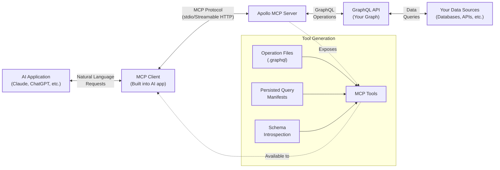

<PreviewFeature>

This feature is in [preview](/graphos/resources/feature-launch-stages#preview). Your questions and feedback are highly valued—don't hesitate to get in touch with your Apollo contact or post in the [Apollo Community MCP Server Category](https://community.apollographql.com/c/mcp-server/41).

</PreviewFeature>

Apollo MCP Server provides a standard way for AI models to access and orchestrate your APIs running with Apollo.

## What is MCP?

[Model Context Protocol (MCP)](https://modelcontextprotocol.io/introduction) is an open protocol that standardizes how applications provide context to AI models like Large Language Models (LLM). MCP enables LLMs and AI agents to indirectly fetch data from external sources.

MCP follows a client-server architecture. MCP servers expose functions, called _tools_, that MCP clients can invoke.

## What is Apollo MCP Server? 

Apollo MCP Server is an implementation of an MCP server. It makes GraphQL API operations available to AI clients as MCP tools. You can use Apollo MCP Server with any GraphQL API.

The GraphQL operations can be configured from persisted queries, which are predefined, approved lists of operations that are registered with and maintained by a graph. The operations can also be determined by AI introspecting your graph schema.

Apollo MCP Server is deployable in local environments via Apollo's Rover CLI or in containerized services in your cloud infrastructure. It can expose an MCP endpoint using Streamable HTTP for communication with AI clients.

## How Apollo MCP Server works

Apollo MCP Server bridges AI applications and your GraphQL APIs, translating GraphQL operations into MCP tools that AI models can discover and use.

The architecture enables intelligent API orchestration through these components:

* AI Applications: Tools like Claude Desktop or ChatGPT connect to Apollo MCP Server through their built-in MCP clients, making requests in natural language.
* Transport Options: Communication happens over stdio for local development or Streamable HTTP. 
* Tool Generation: Apollo MCP Server creates MCP tools from your GraphQL operations using:
    * Operation Files: Individual `.graphql` files for specific queries or mutations
    * Persisted Query Manifests: Pre-approved operation lists from Apollo GraphOS
    * Schema Introspection: Dynamic operation discovery for flexible AI exploration

Secure Execution: When invoked, the server executes GraphQL operations against your API endpoint, respecting all existing authentication, headers, and security policies.
Existing Infrastructure: Your GraphQL API handles requests normally, with Apollo MCP Server acting as a controlled gateway rather than requiring any changes to your graph.

This design lets you expose precise GraphQL capabilities to AI while maintaining complete control over data access and security.

### Example usage

Once configured, AI applications can use your GraphQL operations naturally:

> User: "Show me the astronauts currently in space"
>
> Claude: *Uses GetAstronautsCurrentlyInSpace tool to query your GraphQL API*
>
> "There are currently 7 astronauts aboard the ISS..."

## Why GraphQL for AI?

GraphQL's architecture provides unique advantages for AI-powered API orchestration:

**🎯 Deterministic Execution**: GraphQL's built-in relationship handling and query structure eliminate guesswork for AI models. The graph defines clear paths between data types, ensuring AI agents execute operations in the correct sequence without complex prompt engineering or error-prone orchestration logic.

**🛡️ Policy Enforcement**: Security policies and access controls apply consistently across all services within a single GraphQL query context. This unified enforcement model ensures AI operations respect organizational boundaries, even when spanning multiple underlying APIs or microservices.

**⚡ Efficiency**: AI agents can request precisely the data needed in a single GraphQL query, reducing API calls, network overhead, and token usage. This focused approach delivers faster responses and lower operational costs compared to orchestrating multiple REST endpoints.

**🔄 Agility**: The pace of AI development demands infrastructure that can evolve daily. GraphQL's declarative approach lets teams rapidly create, modify, and deploy new AI capabilities through self-service tooling. Product teams can wire up new MCP tools without waiting for custom development, keeping pace with AI's unprecedented velocity.

With Apollo MCP Server, these GraphQL advantages become immediately accessible to AI applications through standardized MCP tools.

## Benefits of Apollo MCP Server

- **🤖 Enable AI-enabled API orchestration**. With Apollo MCP Server, AI models can act as intelligent orchestrators of their GraphQL API operations. By exposing GraphQL operations as distinct MCP tools, AI clients can dynamically chain these operations together, in combination with other MCP servers and tools to execute complex workflows and automate multi-step processes. 

- **🚀 Connect AI to GraphQL in Minutes**. Developers can expose existing or new GraphQL API operations to AI clients without building complex custom integrations. By translating GraphQL functionalities into standardized MCP tools, Apollo MCP Server can significantly reduce the effort needed to connect AI to diverse data sources.

- **🔒 Maintain Full Security Control**. By using pre-defined, pre-approved persisted queries, developers can maintain precise governance over which data and operations AI clients can access. This ensures that AI uses existing security protocols and data access policies.

## Prerequisites

- A GraphQL API
- An MCP Client

## Getting started

Ready to connect AI to your GraphQL API? Follow our [5-minute quickstart](/apollo-mcp-server/quickstart) to see Apollo MCP Server in action, or explore the [config file reference](/apollo-mcp-server/config-file) for detailed configuration options.
