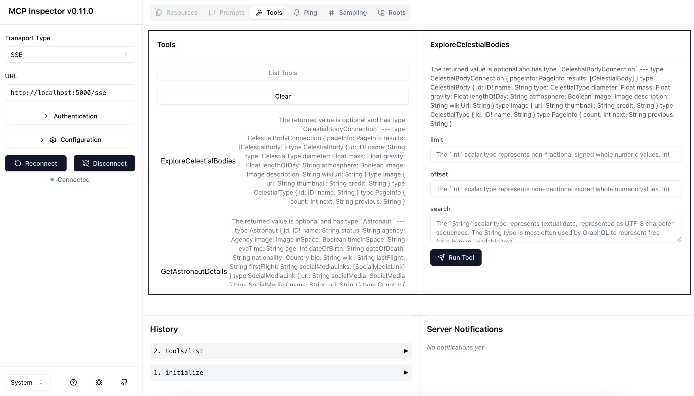
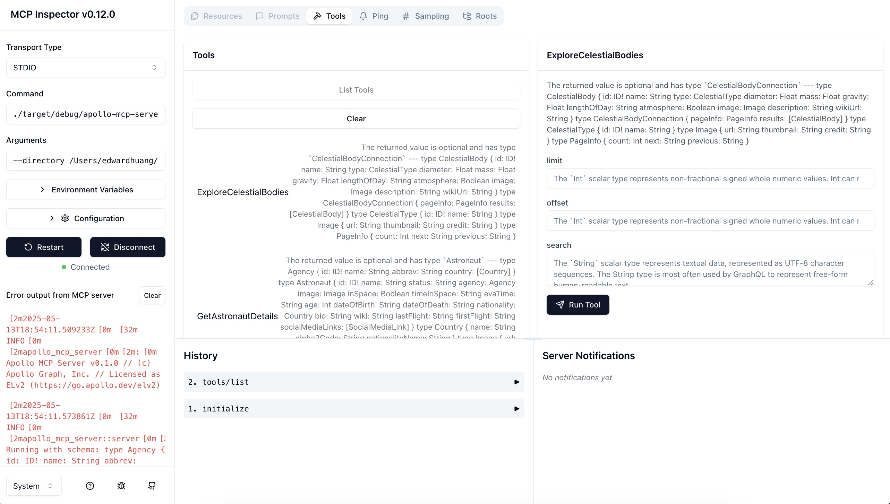

<ExperimentalFeature>

This feature is [experimental](/graphos/resources/feature-launch-stages#experimental). Your questions and feedback are highly valued—don't hesitate to get in touch with your Apollo contact or post in the [Apollo Community MCP Server Category](https://community.apollographql.com/c/mcp-server/41).

</ExperimentalFeature>

Let's run Apollo MCP Server for the first time! You will:

- Understand an MCP Server example.
- Run an MCP Server example.
- Connect an MCP client (Claude Desktop) to the MCP Server.

<OdysseyCallout>

If you learn best with videos and exercises, this [interactive course](https://www.apollographql.com/tutorials/intro-mcp-graphql) teaches you how to set up Apollo MCP Server and create tools from GraphQL operations.

</OdysseyCallout>

## Prerequisites

- Clone the [Apollo MCP Server repo](https://github.com/apollographql/apollo-mcp-server).

## Step 1: Understand MCP Server example

This guide uses an MCP example from the Apollo MCP Server repo. The example uses APIs from [The Space Devs](https://thespacedevs.com/), and it defines a federated graph and the GraphQL operations of the graph to expose as MCP tools.

Let's walk through the example files. They're located in the repo in `graphql/TheSpaceDevs/`:
- `supergraph.yaml` is a [supergraph configuration file](/rover/commands/supergraphs#yaml-configuration-file) for the Rover CLI.
- The `operations/` directory has `*.graphql`operations schema files. Each file defines a GraphQL operation on the graph, and Apollo MCP Server creates an MCP tool from each operation file it's given.
- The `persisted_queries/` directory has a persisted query manifest (PQM) file. It defines the operations that've been registered with the graph as persisted queries and that can be read and turned into tools by the MCP Server.

## Step 2: Run MCP Server example

Choose one of the options for running an MCP example:

- Running `rover dev` to start an MCP Server using the SSE transport
- Running a local binary of the MCP Server using the stdio transport

Both use [MCP Inspector](https://modelcontextprotocol.io/docs/tools/inspector) to connect to and inspect the running server.
<br/>

<Tabs>

<Tab label="rover dev + SSE">

You can run the Apollo MCP Server together with a graph in a local development environment with a single `rover dev` command. Rover starts an MCP Server that communicates via SSE transport.

1. Install [Apollo Rover CLI](/rover/getting-started) v0.31 or later. 
1. From the root directory of your local repo, run `rover dev` to start a local graph, using `--mcp*` options to start and configure an Apollo MCP Server.

    ```sh showLineNumbers=false
      rover dev --supergraph-config ./graphql/TheSpaceDevs/supergraph.yaml \
      --mcp \
      --mcp-operations ./graphql/TheSpaceDevs/operations/ExploreCelestialBodies.graphql ./graphql/TheSpaceDevs/operations/GetAstronautDetails.graphql ./graphql/TheSpaceDevs/operations/GetAstronautsCurrentlyInSpace.graphql ./graphql/TheSpaceDevs/operations/SearchUpcomingLaunches.graphql
    ``` 

    - `--mcp` starts an Apollo MCP Server
    - `--mcp-operations` sets the list of operations

1. Start MCP Inspector, then open a browser and go to [`http://127.0.0.1:6274`](http://127.0.0.1:6274):

    ```sh
    npx @modelcontextprotocol/inspector
    ```

1. Fill in the details in Inspector:
    - **Transport Type**: Select `SSE`
    - **URL**: Enter `http://localhost:5000/sse` (5000 is the default port of the MCP server)

1. Click **Connect**, then click **List Tool**. Inspector should show the tools from your server.

    

</Tab>

<Tab label="Local binary + stdio">

You can run an Apollo MCP Server locally to communicate over stdio.

1. Download the binary of the latest version of Apollo MCP Server. Add it to your path.
1. Use MCP Inspector to run the Apollo MCP Server binary:

    ```sh showLineNumbers=false
    npx @modelcontextprotocol/inspector apollo-mcp-server \
    --directory <absolute-path-to-MCP-example-dir>
    --schema api.graphql \
    --operations operations/ExploreCelestialBodies.graphql operations/GetAstronautDetails.graphql operations/GetAstronautsCurrentlyInSpace.graphql operations/SearchUpcomingLaunches.graphql \
    --endpoint https://thespacedevs-production.up.railway.app/ 
    ```
1. Open a browser and go to the Inspector URL at [`http://127.0.0.1:6274`](http://127.0.0.1:6274).
1. Fill in the details in Inspector:
    - **Transport Type**: Select `STDIO`
    - **Command**: Should be prepopulated with the command to run the MCP Server

1. Click **Connect**, then click **List Tool**. Inspector should show the tools from your server.

    

</Tab>
</Tabs>

## Step 3: Connect an MCP client

This quickstart using Claude Desktop as the MCP client. Configure Claude Desktop to use the tools from your MCP Server with these steps:

1. Open Claude's JSON config file, and add a configuration to connect to the MCP Server. You can connect via stdio or SSE transport:

    <CodeColumns cols={2}>

    ```json title="stdio"
    {
      "mcpServers": {
        "thespacedevs": {
          "command": "<absolute-path-to-MCP-server-binary>",
          "args": [
            "--directory",
            "<absolute-path-to-MCP-example-directory>",
            "--schema",
            "api.graphql",
            "--operations",
            "operations/ExploreCelestialBodies.graphql",
            "operations/GetAstronautDetails.graphql",
            "operations/GetAstronautsCurrentlyInSpace.graphql",
            "operations/SearchUpcomingLaunches.graphql",
            "--endpoint",
            "https://thespacedevs-production.up.railway.app/"
          ]
        }
      }
    }
    ```

    ```json title="SSE"
    {
      "mcpServers": {
        "thespacedevs": {
            "command": "npx",
            "args": [
                "mcp-remote",
                "http://127.0.0.1:5000/sse",
                "--transport",
                "sse-first"
            ]
        }
      }
    }
    ```

    </CodeColumns>

1. Restart Claude, then check that your server's tools are available from the input box.

That's it! You've hooked up the Apollo MCP Server to Claude and can now use the MCP Server's tools in Claude.

## Next steps

See the [user guide](/apollo-mcp-server/guides) to learn how to create tools from [operation schema files](/apollo-mcp-server/guides#from-operation-schema-files), [persisted query manifests](/apollo-mcp-server/guides/#from-persisted-query-manifests), or [schema introspection](/apollo-mcp-server/guides/#from-schema-introspection).

### Additional resources

Check out these blog posts to learn more about Apollo MCP Server:

- [Getting started with Apollo MCP Server](https://www.apollographql.com/blog/getting-started-with-apollo-mcp-server-for-any-graphql-api)
- [The Future of MCP is GraphQL](https://www.apollographql.com/blog/the-future-of-mcp-is-graphql)

